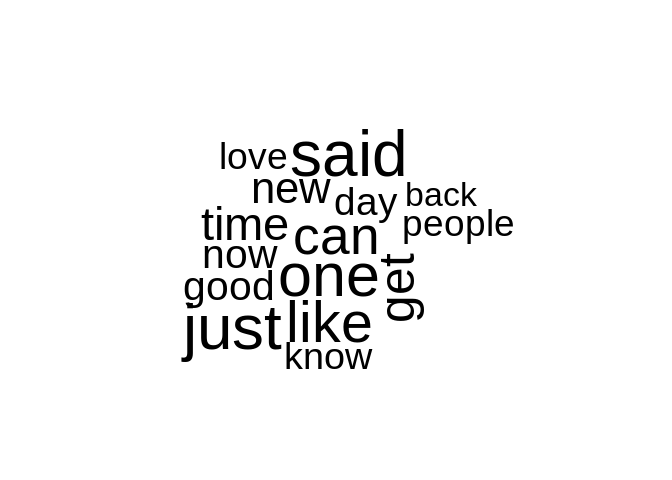

## Download the data

The data used for training our prediction algorithm originates from a corpus of English texts scraped from different blogs, news pages and twitter. Unfortunately the original source is not accessible anymore, but has been archived using this [link](https://web.archive.org/web/20160811062439/http://www.corpora.heliohost.org:80/index.html). First we download the data if not already present in the directory.


```r
fileName <- 'swiftkey.zip'

## Defined folder in zip file
folderName <- 'final'

## Download dataset if not exist
if (!file.exists(fileName)){
  download.file('https://d396qusza40orc.cloudfront.net/dsscapstone/dataset/Coursera-SwiftKey.zip',
                fileName)
}

## Unzip files if not done previously
if (!file.exists(folderName)){
  unzip(fileName)
}
```

## Basic summary


```r
filesizeBlogs <- file.info('final/en_US/en_US.blogs.txt')$size * 0.000001 
filesizeNews <- file.info('final/en_US/en_US.news.txt')$size * 0.000001 
filesizeTwitter <- file.info('final/en_US/en_US.twitter.txt')$size * 0.000001 

numLines <- function(filename){
  con <- file(filename,open="r")
  numlines <- 0
  
  ( while((lines <- length(readLines(con,10000))) > 0 )
  numlines <- numlines+lines )
  close(con)
  numlines
}

suppressWarnings(linesBlogs <- numLines('final/en_US/en_US.blogs.txt'))
suppressWarnings(linesNews <- numLines('final/en_US/en_US.news.txt'))
suppressWarnings(linesTwitter <- numLines('final/en_US/en_US.twitter.txt'))

maxCharacters <- function(fileName){
  con <- file(fileName,open="r")
  maxLength <- 0
  
  while ( TRUE ) {
    line <- readLines(con, 10000)
    if ( length(line) == 0 ) {
      break
    }
    newMax <- max(nchar(line))
    maxLength <- max(maxLength,newMax)
  }
  
  close(con)
  maxLength
}

suppressWarnings(maxTwitter <- maxCharacters('final/en_US/en_US.twitter.txt'))
suppressWarnings(maxBlogs <- maxCharacters('final/en_US/en_US.blogs.txt'))
suppressWarnings(maxNews <- maxCharacters('final/en_US/en_US.news.txt'))


wordCount <- function(fileName){
  con <- file(fileName,open="r")
  count <- 0
  
  while ( TRUE ) {
    line <- readLines(con, 10000)
    if ( length(line) == 0 ) {
      break
    }
    count <- count + wordcount(line)
  }
  
  close(con)
  count
}

suppressWarnings(wcTwitter <- wordCount('final/en_US/en_US.twitter.txt'))
suppressWarnings(wcBlogs <- wordCount('final/en_US/en_US.blogs.txt'))
suppressWarnings(wcNews <- wordCount('final/en_US/en_US.news.txt'))

summary <- data.frame(c('Blogs','News','Twitter'),
                      c(filesizeBlogs,filesizeNews,filesizeTwitter),
                      c(linesBlogs,linesNews,linesTwitter),
                      c(maxBlogs,maxNews,maxTwitter),
                      c(wcBlogs,wcNews,wcTwitter))

names(summary) <- c('Article type', 'Filesize [MB]', 'Lines', 'Max length', 'Word count')

pander(summary)
```


------------------------------------------------------------------
 Article type   Filesize [MB]    Lines    Max length   Word count 
-------------- --------------- --------- ------------ ------------
    Blogs           210.2       899288      40833       37334131  

     News           205.8       1010242     11384       34372530  

   Twitter          167.1       2360148      140        30373543  
------------------------------------------------------------------

From the table above we can see some basic statistics of the English texts supplied by article type. We show the filesize in MB, the number of lines, maximum number of characters per line and the word count of each file. We can conclude that the word count is rather equally distributed amongst the three sources. Therefore, we will draw an equal sample from these sources.

## Exploratory data analysis

The data files for the exploratory data analysis are prepared in a separate script due to the runtime of the individual components, which can be reproduced from my [github repository](https://github.com/LateNightCoder0815/datasciencecapstone). To avoid ressource limitations 30% of the data files have been sampled for the analysis.

### Single words


```r
## Load the cleaned tokens provided by prepare.R script
## Scripts are provided in my github repository

load(file='data/myTokens.RData')

## Build 1 grams
myDFM1 <- dfm(myTokens, ngrams = 1)
rm(myTokens)

## Get the top 10
topn1 <- topfeatures(myDFM1,10)

topn1df <- data.frame(word=names(topn1),frequency=topn1)

## Sort data for diagram in factor variable
topn1df$word <- factor(topn1df$word, 
                       levels = topn1df$word[order(topn1df$frequency,
                                                   decreasing = TRUE)])

ggplot(data=topn1df, aes(x=word, y=frequency)) +
  geom_bar(stat="identity")+
  labs(title = 'Top 10: words in data set', 
       y = 'Frequency', x = 'Words')+
  theme_minimal() +
  theme(axis.text.x = element_text(angle = 90, hjust = 1)) 
```

<!-- -->

From the chart above we can see that the most frequent words are 'said' and 'just'. This analysis has been conducted after cleaning the data including removing:

* punctuation
* numbers 
* symbols 
* twitter tags
* urls 
* stopwords
* profanity words.

All words have been converted to lower case.


```r
textplot_wordcloud(myDFM1, max.words = 15)
```

<!-- -->

The word cloud above gives a nice picture of the most frequent words in the data set.


Task: How many unique words do you need in a frequency sorted dictionary to cover 50% of all word instances in the language? 90%? 

```r
## Get the frequency matrix
freq <- select(textstat_frequency(myDFM1),c('feature','frequency'))
rm(myDFM1)

calcFreq <- function(p,column){
  totalFreq <- sum(column)
  sumFreq <- 0
  count <- 0
  
  for (f in column) {
        sumFreq <- sumFreq + f
        count <- count +1
        if (sumFreq / totalFreq > p)
          break
  }
  count
}
```

We need 1048 items in the dictionary to cover 50% and 1.7784\times 10^{4} elements to account for 90% of the overall frequency. The total dictionary has 3.99116\times 10^{5} unique words.

### 2-grams


```r
rm(freq)
load(file='data/freq2.RData')

## Get top words
topn2df <- freq2[1:10,]
rm(freq2)

## Merge features and predict for plot
topn2df <- unite(topn2df,feature, c('feature','predict'),sep=' ')

## Sort data for diagram in factor variable
topn2df$feature <- factor(topn2df$feature, 
                       levels = topn2df$feature[order(topn2df$frequency,
                                                   decreasing = TRUE)])

## Make plot
ggplot(data=topn2df, aes(x=feature, y=frequency)) +
  geom_bar(stat="identity")+
  labs(title = 'Top 10: 2-grams in data set', 
       y = 'Frequency', x = 'Words')+
  theme_minimal() +
  theme(axis.text.x = element_text(angle = 90, hjust = 1)) 
```

<!-- -->

From the histogram above we can see the top 10 2-grams in the data set. The phrase 'right now' leads the statistic.

### 3-grams


```r
load(file='data/freq3.RData')

## Get top words
topn3df <- freq3[1:10,]
rm(freq3)

## Merge features and predict for plot
topn3df <- unite(topn3df,feature, c('feature','predict'),sep=' ')

## Sort data for diagram in factor variable
topn3df$feature <- factor(topn3df$feature, 
                       levels = topn3df$feature[order(topn3df$frequency,
                                                   decreasing = TRUE)])

## Make plot
ggplot(data=topn3df, aes(x=feature, y=frequency)) +
  geom_bar(stat="identity")+
  labs(title = 'Top 10: 3-grams in data set', 
       y = 'Frequency', x = 'Words')+
  theme_minimal() +
  theme(axis.text.x = element_text(angle = 90, hjust = 1)) 
```

<!-- -->

From the analysis we can see that the 3-gram "New York City" is most frequent in our analysis. Additionally, we observe that we did not clean up the apostrophe in the combination "happy mother's day" with the pre-processing features in quanteda.


## Roadmap for the Shiny App

The application will use a back-off model to predict the next word in a sentence given the predecessors. First the input is cleaned in the same way as the training data. Then the tokens of the user provided text are compared against already known 4-grams, 3-grams and 2-grams. The word with the highest frequency in the most complex n-gram is choosen as prediction from the model.

We will have to pay particular attention to the memory consumption and the runtime of the application as it will need to run on shinyapps.

Additionally, we want to measure the performance in terms of accuracy and response time on a test data set.

