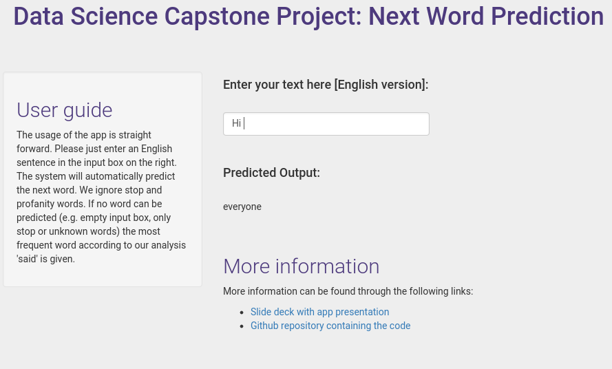

Data Science Capstone: Next Word Prediction
========================================================
author: LateNightCoder0815
date: 29.06.2018
autosize: true
transition: rotate

Executive summary
========================================================

This capstone project is created for the Data Science Specialization
from Johns Hopkins University provided through Coursera.

The application uses a natural language processing (NLP) model to predict
the next word in a sentence.

The model is trained from a corpus of English texts scraped from different
blogs, news pages and twitter.

The prediction model
========================================================

The application uses a back-off model to predict the next word in a sentence
given the predecessors. First the input is cleaned in the same way as the
training data. Then the tokens of the user provided text are compared against
already known 4-grams, 3-grams and 2-grams. The word with the highest frequency in the most complex n-gram is choosen as prediction from the model.

The accuracy on the test data is about 14% taking 15ms per prediction. The model 
has been optimized for fast response times and to fit the low memory environment. The
data files only require about 73 MB of memory.

Information about the application
========================================================

The application has been build using the Shiny development environment. It takes an input from a textbox and outputs the predicted next word.

All pre-processing steps have been performed in the forefront to reduce the app's workload. This includes:

- Sampling a subset of the data
- Cleaning the data (remove punctuation, numbers, symbols, twitter tags, urls, stopwords and profanity words)
- Tokenizing the corpus and building 2-, 3- and 4-grams
- Compressing and optimizing the data files for app use

Live application
========================================================

***
- <a href="https://latenightcoder0815.shinyapps.io/NextWordPrediction/" target="_top"/>Next Word Prediction App</a>
- <a href="https://github.com/LateNightCoder0815/datasciencecapstone" target="_top"/>Github repository</a>

Used ressources:
- <a href="https://www.coursera.org/specializations/jhu-data-science" target="_top"/>Coursera: Data Science Specialization</a>
- <a href="https://github.com/RobertJGabriel/Google-profanity-words" target="_top"/>Profanity words from Google</a>
- <a href="https://web.archive.org/web/20160811062439/http://www.corpora.heliohost.org:80/index.html" target="_top"/>HC Corpora data files</a>

